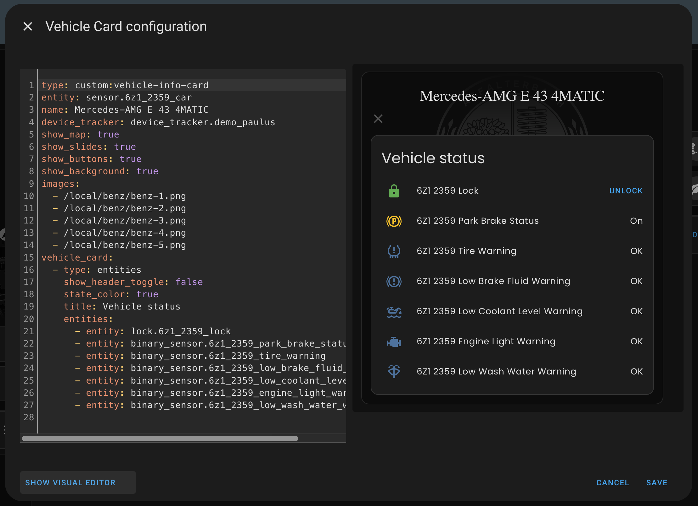
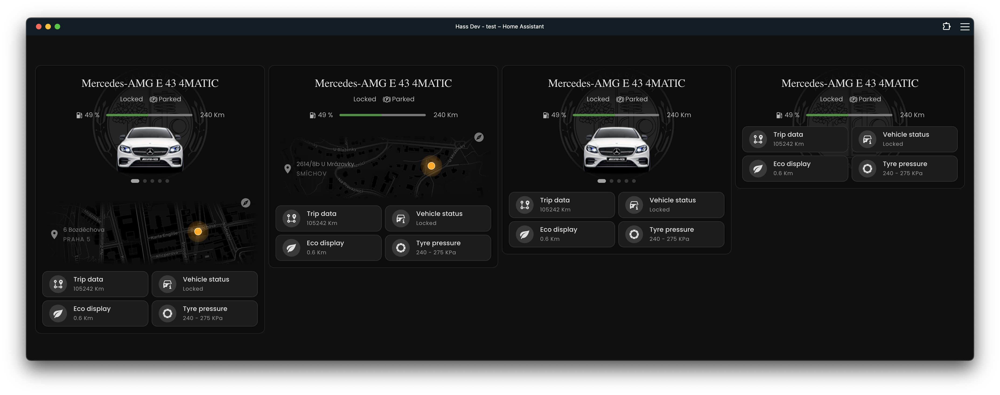
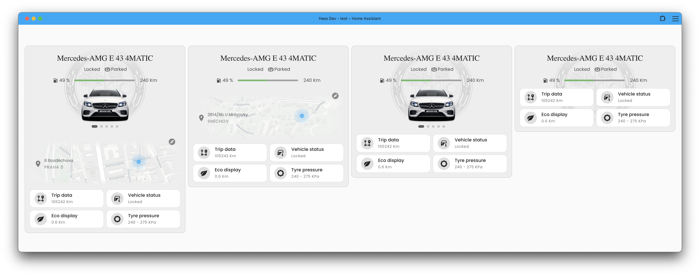
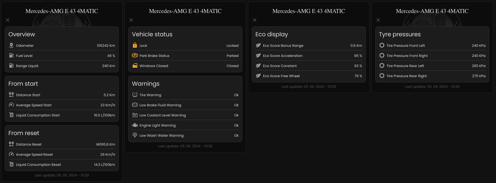
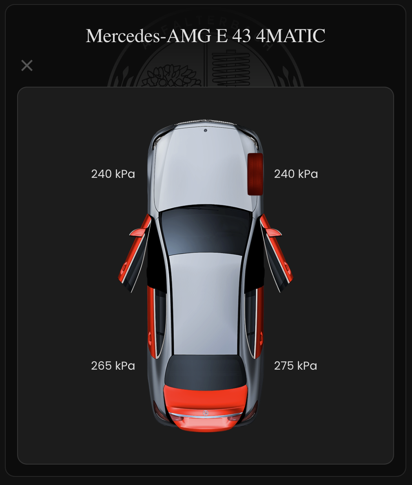
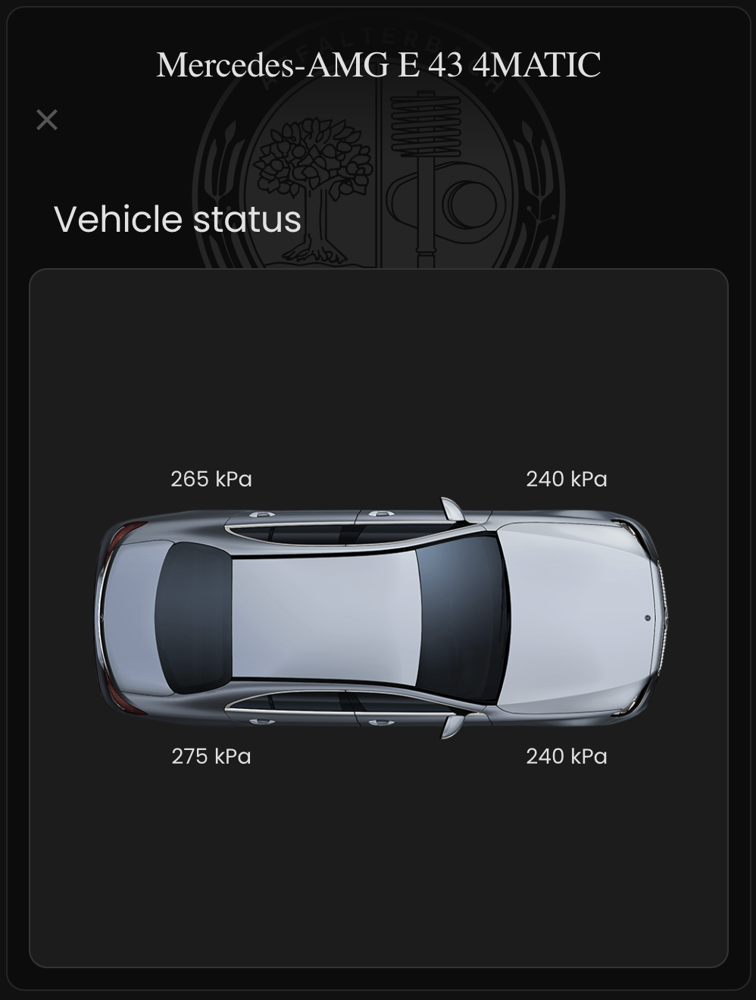

# VEHICLE INFO CARD

<a name="readme-top"></a>

## Home Assistant Custom Card for Mercedes Vehicles

This custom card displays essential information about your Mercedes vehicle. It retrieves data using the Custom Component for Mercedes cars by [ReneNulschDE](https://github.com/ReneNulschDE/mbapi2020) available at [mbapi2020](https://github.com/ReneNulschDE/mbapi2020). The card features four primary buttons: Trip Data, Vehicle Status, Eco Display, and Tire Pressure. These buttons can be easily replaced with any Lovelace card within Home Assistant, allowing for flexible and customizable vehicle data display.

<div align="center">

</div>

<details>
  <summary>Table of Contents</summary>
  <ol>
    <li>
      <a href="#installation">Installation</a>
      <ul>
        <li><a href="#hacs">HACS</a></li>
        <li><a href="#manual">Manual</a></li>
      </ul>
    </li>
    <li>
      <a href="#usage">Usage</a>
      <ul>
        <li><a href="#configuration">Configuration</a></li>
        <li><a href="#options">Options</a></li>
        <li><a href="#example-config">Examples</a></li>
      </ul>
    </li>
    <li><a href="#screenshots">Screenshots</a></li>
    <li><a href="#contributing">Contributing</a></li>
    <li><a href="#license">License</a></li>
  </ol>
</details>

## Installation

### [HACS](https://hacs.xyz) (Home Assistant Community Store)

1. Go to HACS page on your Home Assistant instance
1. Add this repository (https://github.com/ngocjohn/vehicle-info-card) via HACS Custom repositories [How to add Custom Repositories](https://hacs.xyz/docs/faq/custom_repositories/)
1. Select `Frontend`
1. Press add icon and search for `Vehicle Info Card`
1. Select Vehicle Info Card repo and install
1. Force refresh the Home Assistant page (<kbd>Ctrl</kbd> + <kbd>F5</kbd> / (<kbd>Shift</kbd> +) <kbd>⌘</kbd> + <kbd>R</kbd>)
1. Add vehicle-info-card to your page

### Manual

1. Download the 'vehicle-info-card.js'
1. Place the downloaded file on your Home Assistant machine in the `config/www` folder (when there is no `www` folder in the folder where your `configuration.yaml` file is, create it and place the file there)
1. In Home Assistant go to `Configuration->Lovelace Dashboards->Resources` (When there is no `resources` tag on the `Lovelace Dashboard` page, enable advanced mode in your account settings, and retry this step)
1. Add a new resource
   1. Url = `/local/vehicle-info-card.js.js`
   1. Resource type = `module`
1. Force refresh the Home Assistant page (<kbd>Ctrl</kbd> + <kbd>F5</kbd> / (<kbd>Shift</kbd> +) <kbd>⌘</kbd> + <kbd>R</kbd>)
1. Add vehicle-info-card to your page

## Configuration

Basic options can be configured in the GUI editor. This card also offers optional advanced features for enhanced customization. You can enable a slideshow to display images of your car, with the ability to swipe sideways to navigate between images. Additionally, you can display the car's position on a map along with the generated address. To use the map feature, you need to add a device tracker entity. For these options, you will need to use the code editor with YAML configuration.

**Tip:** For the best quality images of your vehicle, use the [Mercedes-Benz API service](https://developer.mercedes-benz.com/products/vehicle_images/docs#) to download them. You can find the Python script for downloading images [here](https://gist.github.com/ngocjohn/b1c1f3730cc6f7079ae0d2b3bddd57ad).

### Options

Below is the basic configuration for the custom card:

| Name              | Type        | Requirement | Description                                                                                                                                                            |
| ----------------- | ----------- | ----------- | ---------------------------------------------------------------------------------------------------------------------------------------------------------------------- |
| `type`            | string      | Required    | `custom:vehicle-info-card`.                                                                                                                                            |
| `entity`          | string      | Required    | The entity ID of the car sensor, e.g., `sensor.license_plate_car`.                                                                                                     |
| `name`            | string      | Optional    | The name to be displayed on the card. Defaults vehicle model name.                                                                                                     |
| `device_tracker`  | string      | Optional    | The entity ID of the device tracker for map display.                                                                                                                   |
| `google_api_key`  | string      | Optional    | Google Maps API key for generating address from coordinates. Defaults to using OpenStreetMap service.                                                                  |
| `show_slides`     | boolean     | Optional    | Set to `true` to enable slideshow of car images. Default is `false`.                                                                                                   |
| `show_map`        | boolean     | Optional    | Set to `true` to display the car's position on a map. Default is `false`.                                                                                              |
| `show_buttons`    | boolean     | Optional    | Set to `true` to show the buttons Default is `true`.                                                                                                                   |
| `show_background` | boolean     | Optional    | Set to `true` to show a background image. Default is `true`.                                                                                                           |
| `images`          | list        | Optional    | List of image URLs or Paths from config/www folder for the slideshow. Images render better with a transparent background and a maximum width of 500px to fit the card. |
| `vehicle_card`    | object list | Optional    | Configuration objects for the vehicle card.                                                                                                                            |
| `trip_card`       | object list | Optional    | Configuration objects for the trip card.                                                                                                                               |
| `eco_card`        | object list | Optional    | Configuration objects for the eco display card.                                                                                                                        |
| `tyre_card`       | object list | Optional    | Configuration objects for the tire pressure card.                                                                                                                      |

### Examples

For advanced options such as the slideshow or map display, you will need to use the code editor,with YAML configuration.

Below is the configuration replaced entities card for `Vehicle status` button.

**Tip:** For an enhanced picture elements card, refer to [this tutorial](https://community.home-assistant.io/t/mercedes-me-component/41911/1809) on the Home Assistant forum. Use downloaded images with the new version of the component for the best results.

<details>

<summary>Yaml Confiuration</summary>

<br />

```yaml
- type: custom:vehicle-info-card
  entity: sensor.6z1_2359_car
  name: Mercedes-AMG E 43 4MATIC
  device_tracker: device_tracker.demo_paulus
  show_map: true
  show_slides: true
  show_buttons: true
  show_background: true
  images:
    - /local/benz/benz-1.png
    - /local/benz/benz-2.png
    - /local/benz/benz-3.png
    - /local/benz/benz-4.png
    - /local/benz/benz-5.png
  vehicle_card:
    - type: entities
      show_header_toggle: false
      state_color: true
      title: Vehicle status
      entities:
        - entity: lock.6z1_2359_lock
        - entity: binary_sensor.6z1_2359_park_brake_status
        - entity: binary_sensor.6z1_2359_tire_warning
        - entity: binary_sensor.6z1_2359_low_brake_fluid_warning
        - entity: binary_sensor.6z1_2359_low_coolant_level_warning
        - entity: binary_sensor.6z1_2359_engine_light_warning
        - entity: binary_sensor.6z1_2359_low_wash_water_warning
```



</details>

## Screenshots




<br />

<details>
  <summary> More screenshots </summary>
    

<p>
**Tip:** For an enhanced picture elements card, refer to <a href="https://community.home-assistant.io/t/mercedes-me-component/41911/1809"> this tutorial</a> on the Home Assistant forum. Use downloaded images with the new version of the component for the best results.
</p>
    
    
</details>

## Contact

2024 Viet Ngoc

Project Link: [https://github.com/ngocjohn/](https://github.com/ngocjohn/)

<p align="right">(<a href="#readme-top">back to top</a>)</p>
